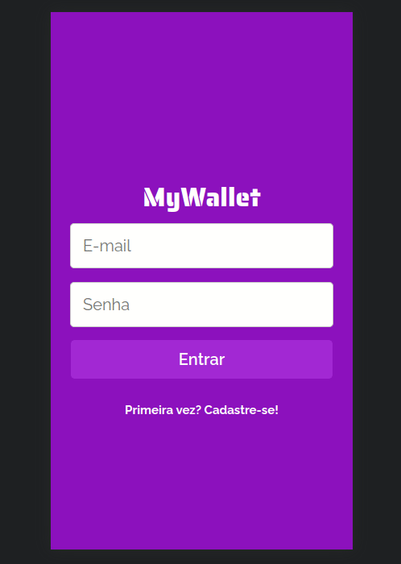

# &middot; My Wallet &middot; 

An easy to use financial manager. Track your revenues and expenses to learn how you spend your money and know all the time how much you have.

Deployed on: https://mywallet-nine.vercel.app/


## About

This is an web application with which lots of people can manage their own expenses and revenues. Below are the implemented features:

Sign Up / Login / List all financial events for a user / Add expense / Add revenue

By using this app any user can learn how they've been using their money and always keep track of your balance.

## Technologies
The following tools and frameworks were used in the construction of the project:<br>
<p>
  
  
  
  
</p>

## Database

In this project, the MongoDB database was used through the website: https://cloud.mongodb.com/

## Installing / Getting started

1. Clone this repository
2. Clone the back-end repository at https://github.com/periebm/mywallet-back
3. Follow instructions to run back-end at https://github.com/periebm/mywallet-back
4. Install dependencies
```bash
npm i
```
5. Run the front-end with
```bash
npm start
```
6. You can optionally build the project running
```bash
npm run build
```
7. Finally access http://localhost:3000 on your browser
